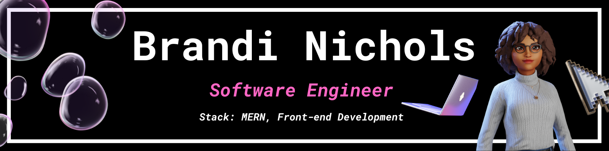

  

# Hey, I'm Brandi a Web-based Software Engineer!

- 🧠 UX background
- 🛠️ Tech stack: MERN stack and front-end development
- 🚀 Building and creating with XR technologies
- 🌱 Always open to collaborating and connecting with other creative technologists

## Languages and Tools

 
   
   
   
   
   

## Connect with me  

<!--
**branic18/branic18** is a ✨ _special_ ✨ repository because its `README.md` (this file) appears on your GitHub profile.

Here are some ideas to get you started:

- 🔭 I’m currently working on ...
- 🌱 I’m currently learning ...
- 👯 I’m looking to collaborate on ...
- 🤔 I’m looking for help with ...
- 💬 Ask me about ...
- 📫 How to reach me: ...
- 😄 Pronouns: ...
- ⚡ Fun fact: ...
-->
