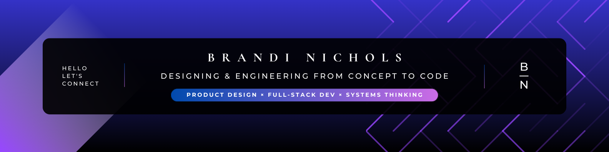

  

# Hey, I'm Brandi, Software Engineer w/ Product Design background!

- 🧠 Skilled in both product design and software engineering, bridging user experience and technical implementation
- 🧪 Experimenting to deeply understand how systems function by breaking them down, reverse engineering and reframing them
- 🔐 Learning secure coding and privacy-by-design to build safer, more responsible products

Outside work: exploring nature, sketching ideas, playing logic games, and reading about design & tech ethics

📌 Read my Security and Privacy Product Playbook below detailing my learning journey in security and privacy. Updated every 1-2 weeks

## Languages and Tools

HTML | CSS | React | JavaScript | Node.js | Express.js | Python | MongoDB

## Connect with me  

<!--
**branic18/branic18** is a ✨ _special_ ✨ repository because its `README.md` (this file) appears on your GitHub profile.

Here are some ideas to get you started:

- 🔭 I’m currently working on ...
- 🌱 I’m currently learning ...
- 👯 I’m looking to collaborate on ...
- 🤔 I’m looking for help with ...
- 💬 Ask me about ...
- 📫 How to reach me: ...
- 😄 Pronouns: ...
- ⚡ Fun fact: ...
-->
